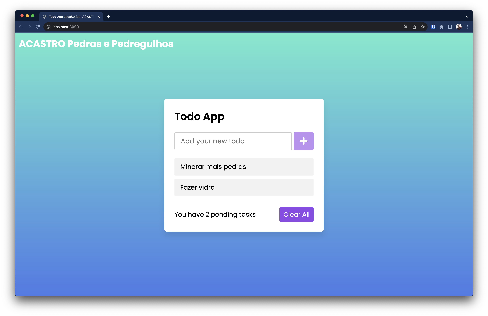

# ACASTRO Pedras e Pedregulhos todo list

Sejam bem-vindos!! Este é o aplicativo todo list da empresa ACASTRO Pedras e Pedregulhos.



Este repositório é um fork do repositório [js-unit-tests-adventure](https://github.com/Valgueiro/js-unit-tests-adventure).


## Requisitos para utilizar:
1. Ter o node + npm instalado na máquina (https://nodejs.org/pt-br/download/)
2. (Opcional, mas bem útil) instalar o VSCode (https://code.visualstudio.com/download)

## Para rodar o exemplo:
1. Dentro da pasta, abra o terminal e rode o seguinte comando para instalar as dependências:
```bash
$ npm install
```

2. Para iniciar o servidor, basta rodar:

```bash
$ npm start
```

3. Assim que iniciar, ele deve abrir uma aba do seu navegador favorito. Se não, acesse:
   * http://localhost:3000 - para a aplicação de Lista de Tarefas (TODO list)
   * http://localhost:3000/tests/index.html - para os testes 


4. Para rodar os testes unitários na linha de comando:
```bash
$ npm run test
```

4. Para rodar os testes de integração na linha de comando:
```bash
$ npm run feature-tests
```
